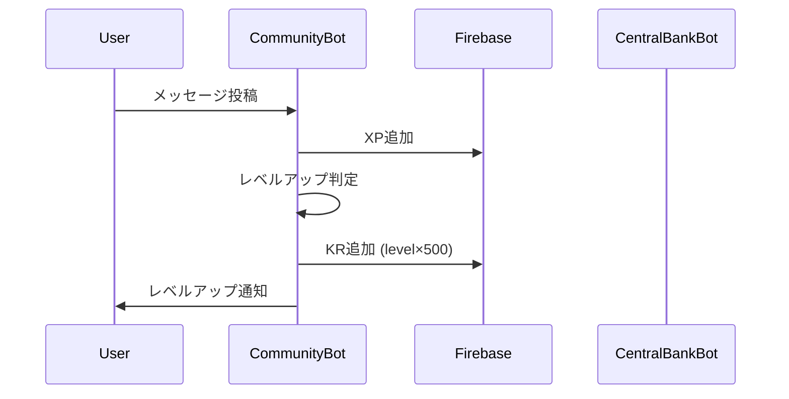
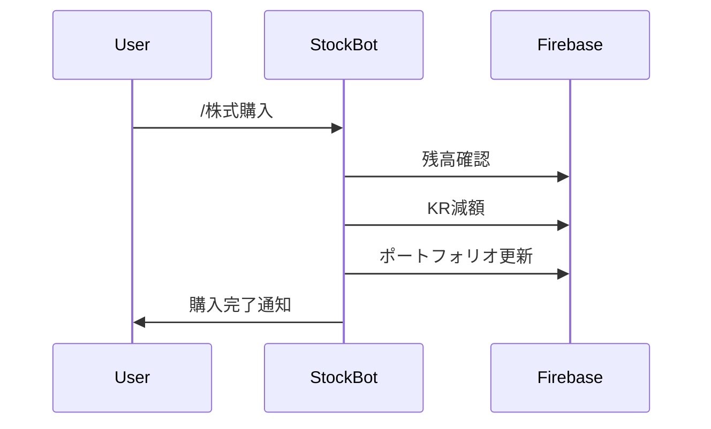
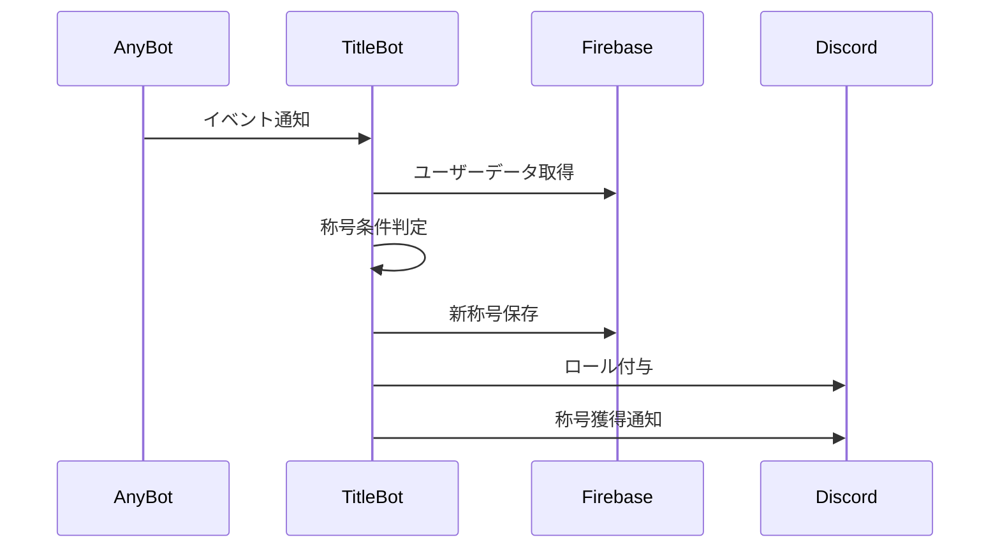

# KRAFT分散型Botシステム API仕様書

## 📋 目次
1. [システム概要](#システム概要)
2. [Firebase データ構造](#firebase-データ構造)
3. [Bot間通信フロー](#bot間通信フロー)
4. [API関数リファレンス](#api関数リファレンス)
5. [エラーハンドリング](#エラーハンドリング)
6. [セキュリティ仕様](#セキュリティ仕様)

## 🏗️ システム概要

### アーキテクチャパターン
- **分散型Bot設計**: 4つの独立したBotが協調動作
- **Firebase中央管理**: 共有データストアとしてFirestore使用
- **イベント駆動型**: 各Botがイベントを発生させ、他Botが反応

### Bot間連携パターン
```
Community Bot → Central Bank Bot (KR付与・減額)
Stock Market Bot → Central Bank Bot (取引決済)
All Bots → Title Bot (称号トリガー)
```

## 🗃️ Firebase データ構造

### `users` コレクション
```json
{
  "user_id": "discord_user_id",
  "balance": 1000,
  "level": 1,
  "xp": 0,
  "total_xp": 0,
  "messages_count": 0,
  "donations_made": 0,
  "donations_received": 0,
  "quests_completed": 0,
  "last_message_xp": "2025-01-01T00:00:00",
  "titles": ["称号1", "称号2"],
  "monthly_messages": 0,
  "active_channels": ["channel_id1", "channel_id2"],
  "consecutive_quest_failures": 0,
  "donation_total": 0,
  "transfer_total": 0,
  "investment_profit": 0,
  "became_zero_by_donation": false,
  "became_zero_by_investment": false,
  "became_zero_by_transfer": false,
  "last_monthly_reset": "2025-01-01T00:00:00",
  "created_at": "timestamp"
}
```

### `personal_quests` コレクション
```json
{
  "user_id": "discord_user_id",
  "title": "クエストタイトル",
  "description": "クエスト説明",
  "deadline": "2025-12-31T23:59:59",
  "xp_reward": 100,
  "kr_reward": 0,
  "status": "active",
  "created_at": "timestamp"
}
```

### `transactions` コレクション
```json
{
  "user_id": "discord_user_id",
  "transaction_type": "transfer|donation|slot|levelup|adjustment",
  "amount": 1000,
  "target_user_id": "optional_recipient_id",
  "reason": "送金理由",
  "timestamp": "timestamp",
  "balance_before": 5000,
  "balance_after": 4000
}
```

### `trades` コレクション
```json
{
  "user_id": "discord_user_id",
  "symbol": "9984",
  "action": "buy|sell",
  "shares": 10,
  "price": 1200,
  "total_amount": 12000,
  "fee": 120,
  "timestamp": "timestamp"
}
```

### `portfolios` コレクション
```json
{
  "user_id": "discord_user_id",
  "symbol": "9984",
  "shares": 50,
  "average_price": 1150,
  "total_investment": 57500,
  "last_updated": "timestamp"
}
```

### `market_data` コレクション
```json
{
  "symbol": "9984",
  "current_price": 1200,
  "previous_price": 1180,
  "price_change": 20,
  "price_change_percent": 1.69,
  "last_updated": "timestamp",
  "price_history": [
    {"price": 1180, "timestamp": "timestamp1"},
    {"price": 1200, "timestamp": "timestamp2"}
  ]
}
```

## 🔄 Bot間通信フロー

### 1. レベルアップ時のKR付与


### 2. 株式投資時の決済


### 3. 称号獲得判定


## 📚 API関数リファレンス

### kraft_api.py 共通関数

#### `get_user_data(user_id: str) -> Dict`
ユーザーの全データを取得
```python
# 使用例
user_data = get_user_data("123456789")
balance = user_data.get("balance", 1000)
level = user_data.get("level", 1)
```

#### `initialize_user(user_id: str) -> Dict`
新規ユーザーを初期化
```python
# 使用例
user_data = initialize_user("123456789")
# 初期残高1000KR、レベル1で作成
```

#### `add_kr(user_id: str, amount: int, reason: str) -> bool`
KR残高に加算
```python
# 使用例
success = add_kr("123456789", 500, "レベルアップ報酬")
if success:
    print("KR付与成功")
```

#### `subtract_kr(user_id: str, amount: int, reason: str) -> bool`
KR残高から減算
```python
# 使用例
success = subtract_kr("123456789", 1000, "株式購入")
if not success:
    print("残高不足")
```

#### `get_balance(user_id: str) -> int`
現在のKR残高取得
```python
# 使用例
balance = get_balance("123456789")
print(f"残高: {balance:,} KR")
```

#### `add_xp(user_id: str, amount: int) -> Dict`
XP追加とレベルアップ判定
```python
# 使用例
result = add_xp("123456789", 10)
if result["level_up"]:
    print(f"レベル {result['new_level']} にアップ！")
```

#### `get_level_info(user_id: str) -> Dict`
レベル・XP情報取得
```python
# 使用例
info = get_level_info("123456789")
print(f"レベル {info['level']}, XP: {info['current_xp']}/{info['next_level_xp']}")
```

### コミュニティBot専用

#### `calculate_xp_for_level(level: int) -> int`
指定レベルに必要な総XP計算
```python
# 使用例
total_xp = calculate_xp_for_level(10)  # レベル10に必要な総XP
```

#### `calculate_level_and_xp(total_xp: int) -> Tuple[int, int]`
総XPからレベルと現在XP計算
```python
# 使用例
level, current_xp = calculate_level_and_xp(1500)
```

### 株式市場Bot専用

#### `get_stock_price(symbol: str) -> float`
現在の株価取得
```python
# 使用例
price = get_stock_price("9984")
print(f"ハードバンク: {price:,} KR")
```

#### `get_user_portfolio(user_id: str) -> Dict`
ユーザーのポートフォリオ取得
```python
# 使用例
portfolio = get_user_portfolio("123456789")
for symbol, data in portfolio.items():
    print(f"{symbol}: {data['shares']}株")
```

#### `log_investment_transaction(user_id: str, transaction_data: Dict) -> bool`
投資取引ログ記録
```python
# 使用例
transaction = {
    "symbol": "9984",
    "action": "buy",
    "shares": 10,
    "price": 1200,
    "total_amount": 12000,
    "fee": 120
}
log_investment_transaction("123456789", transaction)
```

### 称号Bot専用

#### `log_title_event(user_id: str, event_type: str, data: Dict) -> None`
称号関連イベントログ
```python
# 使用例
log_title_event("123456789", "quest_complete", {"quest_id": "abc123"})
log_title_event("123456789", "economic", {"type": "donation", "amount": 1000})
```

## ⚠️ エラーハンドリング

### 共通エラーパターン

#### Firebase接続エラー
```python
try:
    user_data = get_user_data(user_id)
except Exception as e:
    logger.error(f"Firebase エラー: {e}")
    await interaction.followup.send("❌ データベース接続エラーが発生しました。")
```

#### 残高不足エラー
```python
if not subtract_kr(user_id, amount, reason):
    await interaction.followup.send("❌ 残高が不足しています。")
    return
```

#### 入力値検証エラー
```python
if amount < 100 or amount > 1000000:
    await interaction.followup.send("❌ 金額は100-1,000,000 KRの範囲で入力してください。")
    return
```

### レート制限対応
```python
import asyncio

# Discord API レート制限対策
for item in large_list:
    await process_item(item)
    await asyncio.sleep(1)  # 1秒待機
```

## 🔐 セキュリティ仕様

### 管理者権限チェック
```python
ADMIN_USER_IDS = ["1249582099825164312", "867343308426444801"]

def is_admin(user_id: str) -> bool:
    return str(user_id) in ADMIN_USER_IDS

# 使用例
if not is_admin(interaction.user.id):
    await interaction.response.send_message("❌ 管理者専用コマンドです。", ephemeral=True)
    return
```

### 取引制限
```python
# 金額制限
MIN_TRANSACTION = 100
MAX_TRANSACTION = 1000000

# 頻度制限 (5分で8回)
TRANSACTION_LIMIT = 8
TRANSACTION_WINDOW = 300  # 5分

def validate_transaction_frequency(user_id: str) -> bool:
    # Firebase から最近の取引履歴確認
    recent_transactions = get_recent_transactions(user_id, TRANSACTION_WINDOW)
    return len(recent_transactions) < TRANSACTION_LIMIT
```

### データ検証
```python
def sanitize_input(text: str) -> str:
    """入力値のサニタイズ"""
    import re
    # 危険な文字を除去
    return re.sub(r'[<>&"\']', '', text[:100])

def validate_amount(amount: str) -> int:
    """金額の検証と変換"""
    try:
        value = int(amount)
        if value < MIN_TRANSACTION or value > MAX_TRANSACTION:
            raise ValueError("金額範囲外")
        return value
    except ValueError:
        raise ValueError("無効な金額形式")
```

## 📊 パフォーマンス最適化

### Firebase クエリ最適化
```python
# 良い例: 必要なフィールドのみ取得
user_ref = db.collection("users").document(user_id)
user_doc = user_ref.get()

# 悪い例: 全コレクション取得
all_users = db.collection("users").stream()  # 避ける
```

### 非同期処理
```python
import asyncio

async def process_multiple_users(user_ids: List[str]):
    """複数ユーザーの並列処理"""
    tasks = [process_single_user(user_id) for user_id in user_ids]
    results = await asyncio.gather(*tasks, return_exceptions=True)
    return results
```

### キャッシュ戦略
```python
from functools import lru_cache
import time

@lru_cache(maxsize=128)
def get_stock_data_cached(symbol: str, timestamp: int):
    """株価データのキャッシュ (5分間)"""
    # timestampを5分単位に丸める
    cache_key = timestamp // 300 * 300
    return get_stock_data_from_firebase(symbol)

# 使用例
current_time = int(time.time())
stock_data = get_stock_data_cached("9984", current_time)
```

## 🔄 拡張性設計

### 新Bot追加時の考慮点
1. **データ構造**: 既存のFirebaseコレクションとの互換性
2. **API使用**: kraft_api.py の共通関数活用
3. **イベント通知**: Title Bot への称号トリガー実装
4. **エラーハンドリング**: 統一されたエラーメッセージ形式

### 新機能追加の手順
1. Firebase データ構造設計
2. API関数実装・テスト
3. Bot コマンド実装
4. 称号条件追加（必要に応じて）
5. 統合テスト実行

---

**💡 このAPIドキュメントは、KRAFTシステムの技術的な理解と拡張開発に活用してください。**