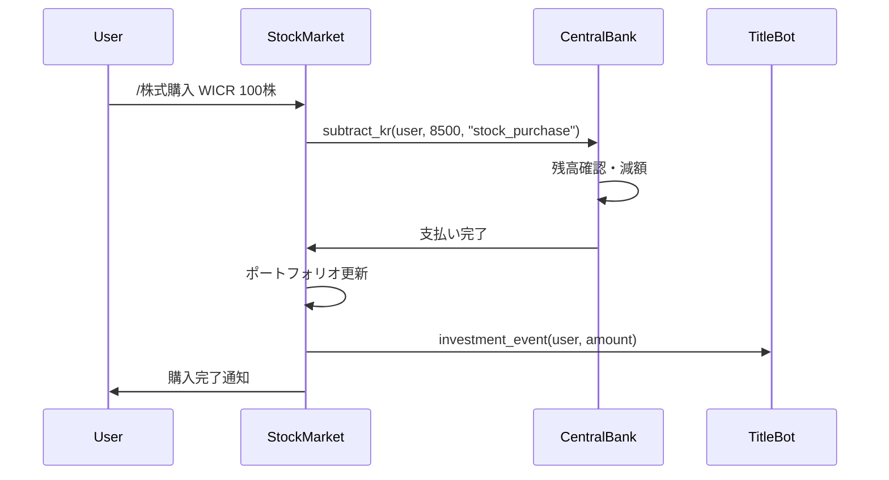
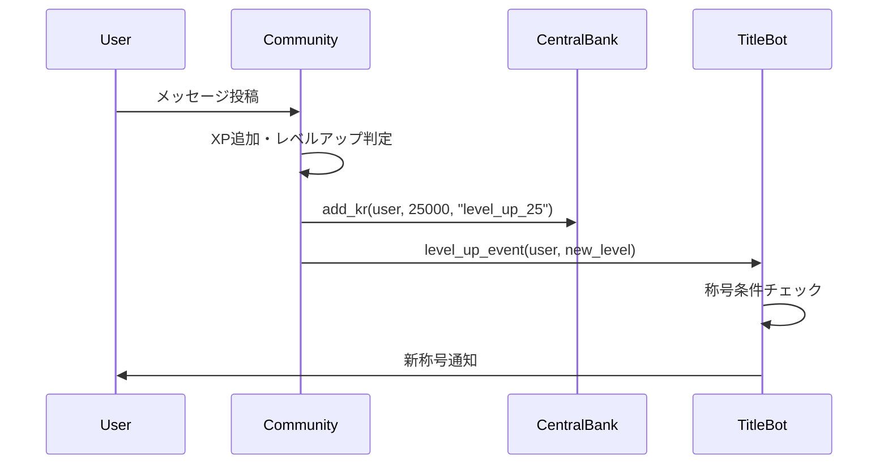

# KRAFT分散型Bot設計書 - 新規構築版

## 🎯 設計方針

### 基本原則
1. **1つのBotは1つの責務**のみを持つ
2. **各Bot最大300行以内**で完結させる
3. **Bot間は明確なAPI経由**で通信する
4. **Firebase失敗でもBot継続**可能にする
5. **段階的に機能追加**できる設計

### 過去の問題点を踏まえた改善
- ❌ 1000行の巨大ファイル → ✅ 300行以内の小さなBot
- ❌ 複雑な機能の混在 → ✅ 明確な責務分離
- ❌ 修正困難 → ✅ 独立したBot修正
- ❌ 一部故障で全停止 → ✅ 他Botは正常稼働継続

---

## 🏗️ 分散アーキテクチャ設計

### 4Bot構成
```
kraft_community_bot.py    # XP・レベル管理（200-250行）
kraft_central_bank.py     # KR管理・送金・ギャンブル（250-300行）
kraft_stock_market.py     # 投資・ニュース・配当（250-300行）  
kraft_title_bot.py        # 称号システム（150-200行）
```

### Bot間通信設計
```python
# 共通API（kraft_api.py）
class KraftAPI:
    @staticmethod
    async def add_kr(user_id: str, amount: int, reason: str):
        """中央銀行にKR追加を依頼"""
        
    @staticmethod
    async def subtract_kr(user_id: str, amount: int, reason: str):
        """中央銀行にKR減額を依頼"""
        
    @staticmethod
    async def get_balance(user_id: str) -> int:
        """残高照会"""
        
    @staticmethod
    async def log_title_event(user_id: str, event_type: str, data: dict):
        """称号Botにイベント通知"""
```

---

## 🎮 KRAFT Community Bot

### 責務
- **XP・レベルシステム**（シンプル版）
- **寄付システム**
- **ユーザープロフィール表示**

### 主要機能
```python
# kraft_community_bot.py（200-250行想定）

class KraftCommunityBot(commands.Bot):
    def __init__(self):
        super().__init__(command_prefix='!', intents=intents)
        self.api = KraftAPI()
    
    @bot.event
    async def on_message(message):
        """メッセージ投稿で5XP付与"""
        if not message.author.bot:
            await self.add_xp(message.author.id, 5)
    
    @tree.command(name="寄付") 
    async def donate(self, interaction, 金額: int):
        """寄付処理（中央銀行と連携）"""
        if await self.api.subtract_kr(user_id, 金額, "donation"):
            # 寄付成功処理
```

### 簡素化されたXPシステム
```python
# XP計算（超シンプル）
def calculate_xp(level: int) -> int:
    """レベルアップ必要XP = level * 100"""
    return level * 100

def get_message_xp() -> int:
    """メッセージXP = 常に5"""
    return 5

def get_level_reward(level: int) -> int:
    """レベルアップ報酬 = 1000 * level"""
    return 1000 * level
```

---

## 🏦 KRAFT Central Bank

### 責務
- **KR残高管理**（全ユーザー）
- **送金システム**
- **KR付与・減額API**
- **ギャンブル機能**
- **取引履歴・監査ログ**

### 主要機能
```python
# kraft_central_bank.py（250-300行想定）

class KraftCentralBank(commands.Bot):
    def __init__(self):
        super().__init__(command_prefix='!', intents=intents)
    
    # 外部Bot向けAPI
    async def add_kr_api(self, user_id: str, amount: int, reason: str):
        """KR追加（レベルアップ報酬など）"""
        await self.update_balance(user_id, amount, "add", reason)
    
    async def subtract_kr_api(self, user_id: str, amount: int, reason: str):
        """KR減額（投資・ギャンブルなど）"""
        if await self.check_balance(user_id, amount):
            await self.update_balance(user_id, -amount, "subtract", reason)
            return True
        return False
    
    @tree.command(name="送金")
    async def transfer(self, interaction, recipient: discord.Member, 金額: int):
        """ユーザー間送金"""
        
    @tree.command(name="ギャンブル")  
    async def gamble(self, interaction, ゲーム: str, 金額: int):
        """ギャンブル機能"""
```

### セキュリティ機能
```python
class SecurityManager:
    def validate_transaction(self, user_id: str, amount: int):
        """取引検証（上限チェックなど）"""
        
    def log_transaction(self, transaction_data: dict):
        """全取引をFirestoreに記録"""
        
    def detect_anomaly(self, user_id: str, amount: int):
        """異常取引の検出"""
```

---

## 📈 KRAFT Stock Market

### 責務
- **株式売買システム**
- **株価管理・変動**
- **ニュース生成・配信**
- **配当システム**
- **ポートフォリオ表示**

### 主要機能
```python
# kraft_stock_market.py（250-300行想定）

class KraftStockMarket(commands.Bot):
    def __init__(self):
        super().__init__(command_prefix='!', intents=intents)
        self.central_bank = CentralBankAPI()
    
    @tree.command(name="株式購入")
    async def buy_stock(self, interaction, 銘柄: str, 株数: int):
        """株式購入（中央銀行と連携）"""
        cost = self.calculate_cost(銘柄, 株数)
        if await self.central_bank.subtract_kr(user_id, cost, f"stock_purchase_{銘柄}"):
            await self.update_portfolio(user_id, 銘柄, 株数, "buy")
    
    @tree.command(name="株式売却")
    async def sell_stock(self, interaction, 銘柄: str, 株数: int):
        """株式売却（中央銀行と連携）"""
        revenue = self.calculate_revenue(銘柄, 株数)
        await self.update_portfolio(user_id, 銘柄, 株数, "sell")
        await self.central_bank.add_kr(user_id, revenue, f"stock_sale_{銘柄}")
```

### 将来拡張予定
```python
# 段階的に追加予定の機能
class FutureFeatures:
    async def ipo_system(self):
        """IPO（新規株式公開）"""
        
    async def derivatives_trading(self):
        """デリバティブ取引"""
        
    async def ai_trader(self):
        """AIトレーダーシステム"""
```

---

## 🏅 KRAFT Title Bot

### 責務
- **称号条件判定**（バックグラウンド）
- **Discordロール付与**
- **称号獲得通知**
- **行動データ監視**

### 主要機能
```python
# kraft_title_bot.py（150-200行想定）

class KraftTitleBot(commands.Bot):
    def __init__(self):
        super().__init__(command_prefix='!', intents=intents)
    
    @tasks.loop(minutes=30)
    async def check_all_titles(self):
        """全ユーザーの称号チェック"""
        users = await self.get_active_users()
        for user_id in users:
            new_titles = await self.check_user_titles(user_id)
            if new_titles:
                await self.grant_titles(user_id, new_titles)
    
    async def check_user_titles(self, user_id: str):
        """ユーザー個別の称号チェック"""
        user_data = await self.get_user_data(user_id)
        return self.evaluate_title_conditions(user_data)
```

### 称号カテゴリー（シンプル）
```python
TITLE_CONDITIONS = {
    # レベル系
    "冒険者": {"condition": "level >= 10"},
    "達人": {"condition": "level >= 50"}, 
    "伝説": {"condition": "level >= 100"},
    
    # 活動系
    "よく喋る人": {"condition": "monthly_messages >= 500"},
    "寄付マスター": {"condition": "donation_total >= 10000"},
    "投資マスター": {"condition": "investment_profit >= 50000"}
}
```

---

## 🔗 Bot間連携フロー

### 株式購入例


### レベルアップ例


---

## 📂 ファイル構成

### 推奨ディレクトリ構造
```
kraft-distributed-bot/
├── shared/
│   ├── kraft_api.py          # Bot間通信API
│   ├── kraft_config.py       # 共通設定
│   ├── kraft_database.py     # Firebase共通処理
│   └── requirements.txt      # 共通依存関係
├── community_bot/
│   ├── kraft_community_bot.py
│   ├── xp_system.py
│   └── quest_system.py
├── central_bank/
│   ├── kraft_central_bank.py
│   ├── transaction_manager.py
│   └── gambling_system.py
├── stock_market/
│   ├── kraft_stock_market.py
│   ├── price_manager.py
│   └── news_generator.py
├── title_bot/
│   ├── kraft_title_bot.py
│   └── title_conditions.py
└── config/
    ├── firebase_credentials.json
    └── .env
```

---

## 🚀 段階的開発プラン

### Week 1: 基盤構築
1. **共通ライブラリ作成**（kraft_api.py, kraft_config.py）
2. **中央銀行Bot**（最小機能：残高管理・送金）
3. **Bot間通信テスト**

### Week 2: コア機能
1. **コミュニティBot**（XP・レベル・クエスト）
2. **中央銀行Bot**（ギャンブル機能追加）
3. **Bot連携テスト**

### Week 3: 拡張機能
1. **株式市場Bot**（基本売買）
2. **称号Bot**（基本称号チェック）
3. **全Bot統合テスト**

### Week 4: 仕上げ
1. **エラーハンドリング強化**
2. **パフォーマンス最適化**
3. **本番デプロイ準備**

---

## 💡 開発のコツ

### 各Botの独立性確保
- 他Botが停止しても自Bot機能は継続
- Firebase接続失敗でも基本動作は維持
- エラーログは各Bot独自で管理

### シンプルさを保つ
- 1つの機能は1つのファイルで完結
- 複雑な計算は避けてシンプルな式を使用
- 設定は外部ファイルで管理

### 段階的な機能追加
- MVP（最小実装）から開始
- 動作確認後に機能追加
- 常にロールバック可能な状態を維持

この設計により、**保守性が高く、拡張しやすい分散型Botシステム**が構築できます！

どのBotから開発を始めますか？